# Fase 1 — Viabilidade e Planejamento

**Projeto:** powerbi-ai-auditor · **Status do documento:** **APROVADO no gate da Fase 1** em 22/09/2026
**Data:** 22/09/2026 · **Revisado em:** 22/09/2026 (verificação de fontes e do ambiente) · **Autor:** Fred (com apoio do Claude)

> **Revisão de 22/09/2026.** As seções 1 e 2 foram conferidas contra a documentação oficial e passam a **VALIDADO**. A seção 3 foi corrigida com o ambiente real medido (GPU de 6 GB, Python 3.11) — ver ADR-002. A seção 8 foi refeita: o repositório `MicrosoftDocs/powerbi-docs` não existe publicamente — ver ADR-004. O dataset de avaliação passou a ser de amostras públicas MIT — ver ADR-005.

> Legenda de status usada em todo o projeto: **PLANEJADO** (decidido, não testado) · **PARCIAL** (testado em parte) · **VALIDADO** (testado com evidência registrada).

---

## 1. Estrutura de uma pasta PBIP

Fonte: Microsoft Learn, *Power BI Desktop project semantic model folder* (página atualizada em 30/05/2026, acessada em 22/09/2026).

```
MeuProjeto.pbip                  ← atalho que abre o projeto no Desktop
MeuProjeto.Report/               ← camada de relatório (FORA do MVP)
MeuProjeto.SemanticModel/        ← modelo semântico (FOCO do MVP)
├── definition.pbism             ← obrigatório; campo "version" indica formatos aceitos
├── model.bim                    ← TMSL (JSON), um único arquivo   ─┐ um OU outro
├── definition/                  ← TMDL, vários arquivos .tmdl      ─┘
│   ├── tables/  roles/  cultures/  perspectives/ ...
├── diagramLayout.json           ← layout do diagrama (ignorar)
├── .platform                    ← metadados do Fabric/Git (ignorar)
├── DAXQueries/  TMDLScripts/    ← abas da visão de consulta DAX/TMDL (ignorar)
└── .pbi/
    ├── localSettings.json       ← gitignored por padrão (caminhos locais)
    ├── cache.abf                ← gitignored por padrão (contém DADOS)
    ├── editorSettings.json, unappliedChanges.json, daxQueries.json, tmdlscripts.json
```

Fatos confirmados na documentação oficial:

- `definition.pbism` versão **1.0** aceita apenas TMSL (`model.bim`); versão **4.0+** aceita TMSL **ou** TMDL.
- **Salvar PBIP em TMDL ainda é recurso em _preview_** (Arquivo > Opções > Recursos de visualização > "Store semantic model using TMDL format").
- **Após converter um projeto para TMDL, não é possível voltar para TMSL.**
- `cache.abf` contém dados do modelo → nunca deve ser lido pela ferramenta nem versionado.

Incertezas registradas:

- O status de *preview* do TMDL pode mudar durante o projeto (a Microsoft pode torná-lo padrão). Ver risco R-01.
- A lista exata de propriedades no `model.bim` varia com o `compatibilityLevel`. O parser deve tolerar propriedades ausentes e desconhecidas.
- **Pendente de validação com um PBIP real seu** (critério de aceite da Fase 1, item G-1).

## 2. TMDL × model.bim — leitura em Python

| Critério | model.bim (TMSL/JSON) | TMDL (pasta `definition/`) |
|---|---|---|
| Leitura em Python | `json.load()` da biblioteca padrão; zero dependências | Exige parser próprio ou biblioteca de terceiros |
| Parser oficial em Python | Não precisa | **Não existe.** O `microsoft/tmdl-parser` (MIT) serve à extensão do VS Code, não é pacote Python. O `tmdl-parser` do PyPI (Atzingen) é projeto pequeno, sem testes e sem cobertura documentada de partições e relacionamentos |
| Estrutura | Um arquivo com árvore previsível: `model.tables[].columns/measures/partitions`, `model.relationships[]` | Vários arquivos; sintaxe por indentação; expressões DAX/M multilinha delimitadas por indentação ou ``` ``` ``` |
| Status no Power BI Desktop | Formato padrão (GA) | Preview; conversão irreversível |
| Legibilidade humana e diffs | Ruim (JSON grande, DAX em arrays de linhas) | Excelente |
| Risco para o prazo | Baixo | Médio/alto (2–3 semanas só de parser e testes) |

**Recomendação: model.bim (TMSL).** É o formato padrão, lê-se com uma linha de Python e elimina o maior risco técnico da Fase 2. Detalhe na ADR-001.
Para não fechar a porta ao TMDL, o parser fica atrás de uma interface simples (`load_model(path) -> ModeloNormalizado`). Suporte a TMDL vai para Trabalhos Futuros.

**Ação para você:** manter **desligado** o recurso de preview "Store semantic model using TMDL format" ao salvar os PBIP do dataset.

## 3. Stack escolhida

Todos os itens rodam nativamente no Windows 11 com **Python 3.11.9**, que já está instalado na máquina. A viabilidade de cada um será confirmada no *spike* da semana 2 (ver roadmap). Justificativa completa na **ADR-002**.

| Camada | Escolha (simples, recomendada) | Alternativa avançada | Por que a simples |
|---|---|---|---|
| Linguagem | **Python 3.11.9** + `venv` + `pip` | `uv`/Poetry | Já instalado; wheels prontos para toda a stack; 3.13 ainda tem atraso de wheels em pacotes de ML |
| Interface | **Streamlit** | FastAPI + React | Upload de .zip, tabelas e filtros prontos, só Python |
| Parser | `json` (stdlib) + **Pydantic** para o JSON interno | Parser TMDL próprio | Validação de esquema e mensagens de erro claras |
| Regras | Funções Python puras (1 regra = 1 função com ID, categoria, severidade), inspiradas no BPA do Tabular Editor | Executar o BPA via Tabular Editor CLI | Sem dependência .NET; testável com pytest |
| Análise de DAX/M | Heurísticas com expressões regulares sobre o texto | Parser DAX completo | Parser DAX completo não cabe no prazo (limitação declarada) |
| Framework RAG | **Sem framework**: pipeline próprio curto (coleta → chunk → embed → Chroma) | LlamaIndex / LangChain | Didático, poucas abstrações, fácil de explicar na banca |
| Embeddings | `BAAI/bge-small-en-v1.5` via `sentence-transformers` (~130 MB, roda em CPU) | `BAAI/bge-m3` (multilíngue, ~2 GB) | Fontes em inglês; consultas geradas pelas regras em inglês |
| Banco vetorial | **ChromaDB** persistente em disco | FAISS / Qdrant | `pip install`, guarda metadados (URL, título) junto do vetor |
| LLM | **Ollama local**, decidido em dois níveis no spike: `qwen2.5:7b-instruct-q4_K_M` com `num_ctx=4096` **ou** um 3B (`qwen2.5:3b` / `llama3.2:3b`) | API paga de modelo pequeno | Gratuito e local; a GPU tem exatamente 6 GB, então o 7B é o limite e o 3B é a contingência |
| Relatório | **Jinja2** → HTML; PDF com **Playwright** (Chromium, `page.pdf()`) | WeasyPrint | WeasyPrint depende de GTK no Windows (instalação frágil) |
| Testes | pytest | — | Padrão de mercado |
| Avaliação | pandas + scripts em `eval/` | Ragas | Métricas pedidas são simples de calcular à mão |

**Orçamento de memória — ambiente medido em 22/09/2026:** GPU **NVIDIA RTX 2060 com 6144 MiB de VRAM**, 16 GB de RAM, Python 3.11.9 instalado, Ollama ainda não instalado.

6 GB de VRAM é o limite exato, não folga: um modelo 7–8B em Q4_K_M ocupa ~4,7–5,0 GB só de pesos, e o cache de contexto soma em cima disso. Com contexto de 8k o Ollama descarrega camadas para a CPU e a latência sobe. Por isso o `num_ctx` fica fixado em 4096 no candidato de 7B, e existe um candidato de 3B que cabe inteiro na VRAM. Modelos de 13B+ estão descartados. Embeddings + Chroma ficam abaixo de 1 GB e o Streamlit abaixo de 0,5 GB, ambos em RAM.

**Regra de fallback do LLM:** se no spike os dois candidatos locais levarem mais de ~60 s por achado ou falharem na citação obrigatória em mais de 2 de 5 testes, adotar API paga com teto de US$ 10 no projeto inteiro (ADR-006, a abrir se necessário). O código usa uma interface `LLMClient` com duas implementações, para a troca ser uma linha de configuração.

**Idioma do pipeline:** o corpus é em inglês e o `bge-small-en-v1.5` é monolíngue, mas a interface e o relatório são em português. Portanto as **consultas de recuperação são geradas em inglês** (cada regra carrega suas palavras-chave em inglês) e o **LLM redige a saída em português**. Isso evita trocar para um modelo multilíngue de ~2 GB.

**Detecção híbrida (como o LLM entra):** as regras decidem *se existe* o problema. O LLM **nunca** decide se há achado; ele só redige explicação e recomendação a partir do achado + trechos recuperados, com citação obrigatória. Isso torna precisão e recall mensuráveis e reprodutíveis.

## 4. Matriz de funcionalidades

Escala: Complexidade e Risco (B/M/A), Valor para o TCC (B/M/A).

| # | Funcionalidade | Compl. | Risco | Valor | Decisão |
|---|---|---|---|---|---|
| F01 | Upload de .zip e indicação de pasta local | B | B | A | **MVP** |
| F02 | Validação da estrutura PBIP com mensagens claras | B | B | A | **MVP** |
| F03 | Parser model.bim → JSON interno normalizado | M | B | A | **MVP** |
| F04 | Regras DAX (heurísticas regex) — ~8 regras | M | M | A | **MVP** |
| F05 | Regras M (heurísticas) — ~4 regras | M | M | M | **MVP** |
| F06 | Regras de modelagem (relacionamentos, bidirecional, tabelas de data automáticas, etc.) — ~6 regras | M | B | A | **MVP** |
| F07 | Regras de performance estática (tipos, colunas calculadas, cardinalidade inferida por tipo) — ~5 regras | M | M | A | **MVP** |
| F08 | Coleta de fontes com registro de URL/título/organização/data | M | M | A | **MVP** |
| F09 | Chunking, embeddings, indexação Chroma | M | M | A | **MVP** |
| F10 | Recuperação top-K por achado | B | B | A | **MVP** |
| F11 | Geração de explicação/recomendação com citação obrigatória | M | A | A | **MVP** |
| F12 | Interface: resultados, filtros, detalhe com evidência | M | B | A | **MVP** |
| F13 | Relatório HTML | B | B | A | **MVP** |
| F14 | PDF a partir do mesmo HTML | B | M | M | **MVP** |
| F15 | Avaliação: Precision@K, MRR, precisão/recall, rubrica | M | B | A | **MVP** |
| F16 | Cache dos resultados do LLM (para demo pré-processada) | B | B | A | **MVP** |
| F17 | Suporte a TMDL | A | A | M | Trabalhos Futuros |
| F18 | Parser DAX completo (AST) | A | A | M | Trabalhos Futuros |
| F19 | Camada de relatório (PBIR, visuais) | A | A | M | Trabalhos Futuros |
| F20 | Reranking / busca híbrida BM25 | M | M | M | Trabalhos Futuros |
| F21 | Correção automática / PBIP corrigido | A | A | M | Trabalhos Futuros |
| F22 | Multiagente | A | M | B | Trabalhos Futuros |
| F23 | Métricas em runtime (VertiPaq/DAX Studio/XMLA) | A | A | M | Trabalhos Futuros |
| F24 | Entrada PBIX | A | A | B | Trabalhos Futuros |

Meta de regras do MVP: **20 a 25 regras**. Qualidade e rastreabilidade valem mais que quantidade.

## 5. Arquitetura e fluxo ponta a ponta

```mermaid
flowchart LR
    U[Usuário] -->|.zip ou caminho da pasta| UI[app/ Streamlit]
    UI --> ING[core/ingest<br/>extrai zip em pasta temporária<br/>valida estrutura PBIP]
    ING -->|erro claro| UI
    ING --> PAR[core/parser<br/>lê definition.pbism + model.bim]
    PAR --> NORM[(JSON interno normalizado<br/>tabelas, colunas, medidas,<br/>M, relacionamentos)]
    NORM --> RUL[core/rules<br/>regras determinísticas]
    RUL --> ACH[(Achados<br/>id_regra, objeto, evidência,<br/>severidade)]
    ACH --> RET[rag/retrieve<br/>consulta por achado → top-K]
    IDX[(rag/index<br/>ChromaDB)] --> RET
    RET --> LLM[core/analysis<br/>LLMClient: Ollama ou API<br/>explicação + recomendação + citação]
    LLM --> VAL[core/analysis<br/>verifica se a citação<br/>existe nos trechos]
    VAL --> RES[(Resultado final JSON)]
    RES --> UI
    RES --> REP[reports/<br/>Jinja2 → HTML → Playwright → PDF]

    subgraph Offline [Preparação da base RAG — executada uma vez]
      SRC[rag/sources.yaml<br/>URL, título, organização, data] --> COL[rag/collect]
      COL --> CHK[rag/chunk] --> EMB[rag/embed<br/>bge-small-en] --> IDX
    end

    RES --> EV[eval/<br/>compara com ground truth]
```



Orquestração: **sequencial simples** (uma função `run_audit()` que chama cada etapa em ordem). Ver ADR-003.

Segurança e privacidade: a ferramenta nunca lê `.pbi/cache.abf` nem `localSettings.json`; strings de conexão e caminhos encontrados nas consultas M são mascarados antes de ir ao LLM e ao relatório.

## 6. Estrutura do repositório

```
powerbi-ai-auditor/
├── app/
│   └── streamlit_app.py
├── core/
│   ├── ingest.py          # zip/pasta, validação PBIP
│   ├── parser_bim.py      # model.bim → modelo normalizado
│   ├── model.py           # esquemas Pydantic do JSON interno
│   ├── rules/             # dax.py, m.py, modeling.py, performance.py, registry.py
│   ├── analysis.py        # monta prompt, chama LLM, valida citação
│   ├── llm_client.py      # interface + OllamaClient + ApiClient
│   └── pipeline.py        # run_audit() sequencial
├── rag/
│   ├── sources.yaml       # catálogo versionado das fontes
│   ├── collect.py  chunk.py  index.py  retrieve.py
│   └── store/             # ignorado no Git (Chroma + textos baixados)
├── reports/
│   ├── templates/report.html.j2
│   └── export.py          # HTML e PDF
├── tests/
│   ├── fixtures/          # PBIP mínimos sintéticos (model.bim pequenos)
│   └── test_*.py
├── eval/
│   ├── ground_truth.csv
│   ├── queries_retrieval.csv
│   ├── rubric.csv
│   ├── run_eval.py
│   └── results/
├── docs/
│   ├── academic/          # 01-introducao.md … 08-conclusao.md
│   ├── adr/
│   └── project/           # progress-log.md, backlog.md, riscos.md, este documento
├── data/                  # ignorado no Git (PBIP reais)
├── outputs/               # ignorado no Git (relatórios gerados)
├── requirements.txt
├── .env.example           # nunca o .env real
├── .gitignore
└── README.md
```

## 7. Roadmap semanal (13 semanas, ~14 h/semana)

| Sem. | Fase | Objetivo | Entregável verificável |
|---|---|---|---|
| 1 | F1 | Aprovar planejamento; criar repositório; salvar 1 PBIP real em model.bim e inspecionar | Repo no GitHub com docs da Fase 1; `tree` do PBIP real no progress-log |
| 2 | F1 | **Spike técnico**: instalar Python, Ollama, Chroma, Playwright; testar LLM com 5 prompts; confirmar licenças das fontes | Tabela do spike (tempo por resposta, RAM, VRAM) + ADR-002 atualizada para VALIDADO |
| 3 | F2 | Ingestão (.zip/pasta), validação, parser model.bim, esquema Pydantic, fixtures | `pytest` verde; JSON normalizado de 1 PBIP real |
| 4 | F2 | 20–25 regras determinísticas + testes por regra; conversão dos PBIP do dataset | Relatório de achados em JSON para todos os PBIP |
| 5 | F3 | Catálogo de fontes (`sources.yaml`) e coleta | ~60–120 documentos baixados com metadados |
| 6 | F3 | Chunking, embeddings, índice, recuperação; conjunto de consultas de avaliação | Precision@K e MRR preliminares |
| 7 | F3 | Geração com LLM + citação obrigatória + validação da citação | Achados enriquecidos para 1 PBIP |
| 8 | F3 | Ajustes de prompt/chunking; **ground truth** dos 5–8 PBIP (feito por você) | `ground_truth.csv` completo · **Revisão de meio de projeto** |
| 9 | F4 | Interface Streamlit: upload, status, resultados, filtros, detalhe | App ponta a ponta em 1 PBIP |
| 10 | F4 | Relatório HTML/PDF; cache para demo pré-processada | HTML e PDF gerados |
| 11 | F5 | Rodar avaliação completa; aplicar rubrica | `eval/results/` com números reais |
| 12 | F5 | Relatório acadêmico (capítulos 1–8) | Rascunho completo |
| 13 | F5 | Revisão final, roteiro de demo de 15 min, ensaio, plano B | Versão final + ensaio gravado |

**Folga:** não há semana vazia; a folga está embutida no corte de escopo. Se a semana 7 atrasar, o primeiro corte é reduzir regras M e o PDF (o HTML basta), nesta ordem.

## 8. Catálogo de fontes da RAG — verificado em 22/09/2026

> Esta seção foi refeita após verificação. O plano original previa baixar o markdown de `MicrosoftDocs/powerbi-docs`, mas **esse repositório não existe publicamente** (404 na API do GitHub). Evidências e justificativa na **ADR-004**.

| Fonte | Organização | Forma de coleta | Licença / termos | Status |
|---|---|---|---|---|
| Microsoft Learn — Power BI guidance (`/power-bi/guidance`) | Microsoft | Páginas HTML públicas; lista gerada a partir do `toc.json` da seção | Termos de uso do site; `robots.txt` **verificado**, não bloqueia `/power-bi/*` | **VALIDADO** — `toc.json` devolve HTTP 200 e lista **142 artigos** |
| Microsoft Learn — referência de DAX | Microsoft | Idem | Idem | PARCIAL — coletar `toc.json` na semana 5 |
| Microsoft Learn — referência de Power Query M | Microsoft | Idem | Idem | PARCIAL — coletar `toc.json` na semana 5 |
| Microsoft Learn — PBIP e TMDL (`/power-bi/developer/projects`, `/analysis-services/tmdl`) | Microsoft | Idem | Idem | **VALIDADO** — já usado na seção 1 |
| `MicrosoftDocs/fabric-docs` (Direct Lake, fundamentos) | Microsoft | Markdown do GitHub | **CC BY 4.0**, confirmada via API | VALIDADO — fonte secundária, opcional |
| Tabular Editor — Best Practice Rules | Tabular Editor | **Não coletar.** Usar apenas como referência conceitual, com citação da URL | **Sem arquivo LICENSE** (campo `license` = `null` na API). Sem licença explícita, o padrão é "todos os direitos reservados" | **VALIDADO com restrição** — risco R-10 |
| SQLBI (artigos selecionados) e DAX Guide | SQLBI | Lista curta e curada de 10–15 artigos, escolhidos um a um; nunca varredura | Conteúdo protegido por direito autoral. `robots.txt` **verificado**: bloqueia só `/wp-admin/`, `/u/`, `/cert/`, `/learn/`, `/account/`, `/cart/`, `/checkout/`. Uso acadêmico com trechos curtos, citação e cópia local não redistribuída | **VALIDADO** — risco R-05 reduzido |
| Kimball Group — Dimensional Modeling Techniques | Kimball Group | Páginas públicas | A confirmar na semana 5 | PLANEJADO |

Regras de governança da base, válidas para todas as fontes:

1. O repositório versiona o **catálogo** (`rag/sources.yaml`) e o **código de coleta**, nunca o conteúdo baixado. A cópia local fica em `rag/store/`, que está no `.gitignore`.
2. O HTML bruto é guardado em `rag/store/raw/` para permitir reprocessar a extração sem baixar de novo (risco R-13).
3. Cada entrada do `sources.yaml` tem: `id`, `url`, `titulo`, `organizacao`, `data_acesso`, `licenca`, `observacao`.
4. Toda explicação gerada pelo LLM cita um trecho recuperado, e todo trecho carrega a URL e a data de acesso da sua fonte (ADR-003).

## 9. Referências consultadas nesta fase (acesso em 22/09/2026)

- Microsoft Learn — Power BI Desktop project semantic model folder: https://learn.microsoft.com/en-us/power-bi/developer/projects/projects-dataset
- Microsoft Learn — Power BI Desktop projects (PBIP): https://learn.microsoft.com/en-us/power-bi/developer/projects/projects-overview
- microsoft/tmdl-parser (GitHub): https://github.com/microsoft/tmdl-parser
- Atzingen/tmdl-parser (GitHub): https://github.com/Atzingen/tmdl-parser
- TabularEditor/BestPracticeRules (GitHub): https://github.com/TabularEditor/BestPracticeRules
- RuiRomano/pbip-demo (candidato a PBIP público de exemplo; licença a confirmar): https://github.com/RuiRomano/pbip-demo
- Microsoft Learn — Guidance for Power BI (índice, 142 artigos): https://learn.microsoft.com/en-us/power-bi/guidance/overview
- Microsoft Learn — Understand star schema and the importance for Power BI: https://learn.microsoft.com/en-us/power-bi/guidance/star-schema
- Microsoft Learn — robots.txt (verificação de permissão de coleta): https://learn.microsoft.com/robots.txt
- MicrosoftDocs/fabric-docs (CC BY 4.0): https://github.com/MicrosoftDocs/fabric-docs
- microsoft/powerbi-desktop-samples (licença MIT; origem do dataset de avaliação): https://github.com/microsoft/powerbi-desktop-samples
- SQLBI — robots.txt: https://www.sqlbi.com/robots.txt · DAX Guide — robots.txt: https://dax.guide/robots.txt

## 10. Rastreabilidade das decisões

| ADR | Assunto | Status |
|---|---|---|
| ADR-001 | Formato do modelo semântico: `model.bim` (TMSL) | Aceita |
| ADR-002 | Stack tecnológica (revisada com o ambiente medido) | Aceita |
| ADR-003 | Orquestração sequencial e detecção híbrida | Aceita |
| ADR-004 | Coleta da base RAG por páginas públicas do Learn | Aceita |
| ADR-005 | Dataset de avaliação: amostras públicas da Microsoft (MIT) | Aceita |
| ADR-006 | Adoção de API paga para o LLM | A abrir apenas se o spike da semana 2 reprovar os dois modelos locais |
